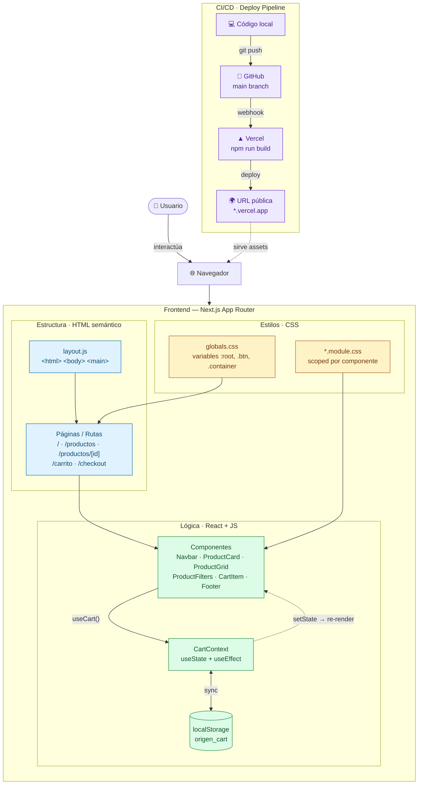

# Parcial Oral — Programación Web (71.38)

> Presentación de 10 minutos · Material complementario: repositorio del proyecto + `PROMPTS.md` con la documentación de prompts utilizados.

---

## Slide 1 — Origen

### ¿Qué es?
**Origen** es una tienda online de **instrumentos musicales** — guitarras eléctricas, acústicas, bajos y accesorios. Permite a un usuario **explorar el catálogo, filtrarlo por categoría, buscar por nombre, agregar instrumentos a un carrito persistente y completar un checkout simulado**.

Tagline: *"Donde nace tu sonido."*

Todo el flujo de compra funciona en el cliente: el carrito sobrevive al recargar la página gracias a `localStorage`, y el checkout valida el formulario y emite un número de orden `ORG-XXXXXX`.

### Stack
| Capa | Tecnología |
|---|---|
| Framework | **Next.js 14** (App Router) |
| Lenguaje | **JavaScript** (ES6 modules) |
| UI | **React 18** + **CSS Modules** |
| Estado global | **React Context** + `localStorage` |
| Datos | Mock local en `src/data/products.js` (12 instrumentos, 4 categorías) *(backend pendiente)* |
| Hosting / CI | **Vercel** + **GitHub** |

### Alcance honesto
- ✅ Frontend completo, responsive, deployable.
- ⏳ Pendiente: backend / Supabase, autenticación, pasarela de pagos.

---

## Slide 2 — Diagrama de Arquitectura



**Lectura del diagrama (los 6 elementos requeridos):**

1. **Usuario y Navegador** como punto de entrada (arriba a la izquierda).
2. **Diferenciación visual** entre Estructura (azul/HTML), Estilos (amarillo/CSS) y Lógica (verde/React-JS).
3. **Páginas y componentes reales** del repo (`/productos/[id]`, `ProductCard`, `CartContext`, etc.).
4. **Flechas de flujo:** el usuario interactúa con un componente → llama a `useCart()` → modifica el Context → actualiza `localStorage`.
5. **Re-render:** la flecha punteada `Context -.-> Components` representa que cuando cambia el estado, React re-renderiza los suscriptores (badge del carrito, totales, etc.).
6. **Pipeline de deploy:** `código local → git push → GitHub → Vercel build → URL pública`.

---

## Slide 3 — Fundamentos HTML / CSS / JS

Cada concepto, anclado a un archivo concreto del repo.

### HTML semántico
- `<header>` y `<nav>` en [Navbar.js:18-49](src/components/Navbar.js)
- `<main>` envolviendo el contenido en [layout.js:15](src/app/layout.js)
- `<article>` por cada producto en [ProductCard.js:18](src/components/ProductCard.js)
- `<footer>` con `<h3>`, `<h4>`, `<ul>` jerárquicos en [Footer.js](src/components/Footer.js)
- `<section>` separando hero, destacados, categorías y beneficios en [page.js](src/app/page.js)

### Accesibilidad / ARIA
- Botón hamburguesa con `aria-label="Abrir menu"` y `aria-expanded={open}` en [Navbar.js:24-25](src/components/Navbar.js)
- `<nav aria-label="Breadcrumb">` en el detalle de producto, [productos/[id]/page.js:40](src/app/productos/[id]/page.js)
- `aria-label` dinámico en cada botón "Agregar" para lectores de pantalla, [ProductCard.js:34](src/components/ProductCard.js)
- `<label htmlFor="...">` asociado a cada `<input>` del checkout

### Responsive (CSS Grid + Flexbox)
- **Grid del catálogo** en [ProductGrid.module.css](src/components/ProductGrid.module.css): 4 → 3 → 2 → 1 columnas según breakpoint.
- **Layout del carrito** en [carrito/page.module.css](src/app/carrito/page.module.css): `1fr 340px` en desktop colapsa a `1fr` debajo de 900px.
- **Flexbox** en la barra de acciones del checkout y en el navbar.

### Eventos en JS
- `onClick` para agregar al carrito en [ProductCard.js:11-14](src/components/ProductCard.js).
- `onClick` de incrementar/decrementar cantidad en [CartItem.js:30-44](src/components/CartItem.js).
- `onSubmit` con `preventDefault` en [checkout/page.js:42-58](src/app/checkout/page.js).
- `onChange` en buscador y selects de [ProductFilters.js](src/components/ProductFilters.js).

### Asincronía (`async/await` + `fetch`)
- ⏳ **Pendiente.** Hoy los productos se importan estáticamente desde `src/data/products.js` (decisión consciente: el alcance del parcial era frontend sin backend). El reemplazo natural es un `useEffect` con `fetch('/api/products')` cuando se agregue Supabase / Next API Routes.

### Validación de formularios
- Validación manual en [checkout/page.js:30-40](src/app/checkout/page.js): chequeo de nombre, regex de email, longitud de teléfono y dirección obligatoria.
- Errores almacenados en `useState` y renderizados con `<span className={styles.error}>` debajo de cada campo.

### Módulos ES6
- `export const products = [...]` y `export function getProductById(id)` en [products.js](src/data/products.js).
- `import { useCart } from "@/context/CartContext"` con alias `@/*` configurado en [jsconfig.json](jsconfig.json).
- Una responsabilidad por archivo: `lib/format.js` solo formatea precios, `context/` solo maneja estado global, `components/` solo presenta UI.

---

## Slide 4 — React + Next.js

### Componente
Un componente es una función que devuelve JSX. Ejemplo: [ProductCard.js](src/components/ProductCard.js) recibe un producto y renderiza la imagen, nombre, precio y botones. Es **reutilizable**: se usa en home (destacados), catálogo y productos relacionados.

### Props vs State

| | Props | State |
|---|---|---|
| Definición | Datos de afuera, **read-only** | Datos internos, **mutables** |
| Ejemplo | `<ProductCard product={p} />` en [ProductGrid.js:14](src/components/ProductGrid.js) — el grid le pasa el producto | `const [quantity, setQuantity] = useState(1)` en [AddToCartButton.js:10](src/app/productos/[id]/AddToCartButton.js) — la cantidad vive dentro del botón |

Otros ejemplos del proyecto:
- **Props:** `<CartItem item={item} />`, `<ProductFilters categories={...} sort={sort} onSortChange={setSort} />`.
- **State:** `items` en `CartContext`, `open` del menú móvil en `Navbar`, `form` y `errors` del checkout, `confirmed` para mostrar la pantalla de éxito.

### `useEffect` — uso funcional, no abstracto
En [CartContext.js:14-30](src/context/CartContext.js) hay **dos efectos** complementarios:

```js
// 1) Hidratar el carrito al montar (corre una sola vez)
useEffect(() => {
  const stored = window.localStorage.getItem("origen_cart");
  if (stored) setItems(JSON.parse(stored));
  setHydrated(true);
}, []);

// 2) Persistir cada cambio (corre cuando items cambia)
useEffect(() => {
  if (!hydrated) return;
  window.localStorage.setItem("origen_cart", JSON.stringify(items));
}, [items, hydrated]);
```

**Por qué dos:** uno tiene `[]` (efecto al montar, leer storage); el otro depende de `[items]` (escribir storage en cada cambio). El flag `hydrated` evita pisar el storage con el array vacío inicial antes de leer.

### Re-render — cuándo y por qué
1. Usuario hace click en "Agregar" → `addItem(product)` en `ProductCard`.
2. `setItems(...)` en el Context → React detecta nuevo estado.
3. **Todos los componentes que llaman `useCart()` se re-renderizan**: el badge de la Navbar muestra +1, los totales del carrito se recalculan, el `useEffect` con dep `[items]` se dispara y guarda en `localStorage`.

### Rutas en Next (App Router)
Mapeo carpeta → URL:

```
src/app/
├── page.js                       →  /
├── productos/
│   ├── page.js                   →  /productos
│   └── [id]/page.js              →  /productos/3   (ruta dinámica)
├── carrito/page.js               →  /carrito
├── checkout/page.js              →  /checkout
└── not-found.js                  →  404
```

`generateStaticParams()` en [productos/[id]/page.js:14](src/app/productos/[id]/page.js) **pre-renderiza estáticamente las 12 páginas de instrumentos en build time** (verificable con `npm run build`: salen como `● (SSG)`).

### Server Components vs Client Components
Next.js renderiza por defecto en el servidor. Un componente es Client solo si lleva `"use client"` arriba.

| Server (sin `"use client"`) | Client (`"use client"`) |
|---|---|
| `app/layout.js` | `components/Navbar.js` (usa `useState`) |
| `app/page.js` (home) | `context/CartContext.js` (hooks + `localStorage`) |
| `app/productos/[id]/page.js` | `components/ProductCard.js` (`onClick`) |
| `app/productos/page.js` (envuelve en `Suspense`) | `app/productos/ProductsView.js` (usa `useSearchParams`) |

**Decisión técnica:** la página `/productos/[id]` es Server Component que hace SSG, pero el botón de agregar al carrito ([AddToCartButton.js](src/app/productos/[id]/AddToCartButton.js)) está aislado como Client porque necesita `useState` y el Context. Así se mantiene la página estática y solo el botón hidrata.

---

## Slide 5 — CI/CD: del commit a la URL pública

```
┌──────────┐  git push   ┌──────────┐  webhook   ┌──────────┐  deploy   ┌──────────┐
│ Local    │ ──────────▶ │ GitHub   │ ─────────▶ │ Vercel   │ ────────▶ │ URL .app │
│ npm dev  │             │  main    │            │ build    │           │ pública  │
└──────────┘             └──────────┘            └──────────┘           └──────────┘
```

### Paso a paso
1. **Desarrollo local:** `npm run dev` en `localhost:3000`. Validación con `npm run lint` (ESLint config de Next) y `npm run build` (compila sin warnings — verificable).
2. **Repositorio en GitHub:** un único repo (frontend del e-commerce). Branch `main`.
3. **Trigger automático:** Vercel está conectado al repo vía webhook de GitHub. Cada `git push` a `main` dispara un build.
4. **Pipeline de Vercel:**
   - Detecta automáticamente Next.js → `npm install` → `npm run build`.
   - Si el build falla, **el deploy se rechaza** y la URL anterior queda intacta.
5. **Deploy automático** en una URL pública del estilo `https://<proyecto>.vercel.app`.
6. **Preview deploys:** cada Pull Request genera una URL temporal de preview, útil para revisar cambios antes de mergear.

### Variables de entorno
- ⏳ **Pendiente.** Como hoy no hay backend ni servicios externos, no hay `.env`. Cuando se sume Supabase: configurar `NEXT_PUBLIC_SUPABASE_URL` y `SUPABASE_ANON_KEY` desde el panel de Vercel → `Settings → Environment Variables`, **nunca commiteadas**.

### `.gitignore`
Cubre `node_modules/`, `.next/`, `.env*.local` y `.vercel/`, así no se sube nada compilado ni secretos.

---

## Slide 6 — Uso fundamentado de IA (Módulo 4)

> Documentación completa de prompts: archivo adjunto **`PROMPTS.md`**.

### Herramientas
- **Claude Code** (CLI agentic en la terminal, integrado a VS Code).
- Justificación: a diferencia de un chat web, Claude Code **lee y escribe archivos directamente en el repo**, ejecuta `npm run build` para validar, y mantiene contexto multi-archivo. Eso permite trabajar a nivel de feature, no de snippet aislado.

### Cómo validé lo generado
1. **Lectura previa:** ningún archivo se aceptó sin leerlo. Por ejemplo, en `CartContext.js` revisé que el segundo `useEffect` no pisara `localStorage` con el estado inicial vacío — por eso el flag `hydrated`.
2. **Validación con build:** `npm run build` después de cada feature grande. **Detectó un error real**: `useSearchParams` en `app/productos/page.js` rompía el prerender estático. La IA propuso (y entendí *por qué*) separar la lógica en un componente `ProductsView` envuelto en `<Suspense>`.
3. **Test manual:** probar en el navegador cada flujo (agregar, quitar, recargar, vaciar, checkout, recargar después del checkout vacío).
4. **Comparar contra la consigna:** descartar cosas que no estaban pedidas (ej. la IA tendía a sugerir Tailwind; lo corté porque la consigna decía CSS Modules).

### Errores que detectó la IA y cómo los resolví
- **Hidratación del carrito vs SSR:** sin la bandera `hydrated`, el navbar mostraba "0" un instante y luego saltaba al número real (mismatch de SSR). Solución: no renderizar el badge hasta `hydrated === true`.
- **Imágenes externas:** al usar `<Image>` de Next con URLs de Unsplash falla si no se declaran `remotePatterns` en `next.config.mjs`. Decisión consciente: `` plano para mantener la consigna simple.
- **`generateStaticParams` con IDs numéricos:** Next exige `string`, no `number`. Lo arreglé con `String(p.id)`.

### Qué entendí yo vs qué generó la IA
- **Generé yo** las decisiones de arquitectura: usar Context y no Redux, mock data en vez de fetch, separar `lib/format.js`, qué archivos llevan `"use client"`.
- **Generó la IA** el boilerplate (CSS Modules, props plumbing, helpers de formato).
- **Verifiqué línea por línea** los efectos críticos (CartContext, validación de checkout) porque ahí estaba el riesgo real de bugs.

### Adjunto
`PROMPTS.md` con los prompts representativos agrupados por feature: setup, datos, contexto del carrito, páginas, deploy.

---

## Checklist final (verificada contra el repo)

- [x] Diagrama con los **6 elementos**: usuario+navegador, HTML/CSS/JS diferenciados, componentes y rutas reales, flechas de flujo, re-render por state, pipeline de deploy.
- [x] Cada concepto técnico apunta a un archivo y línea **reales**.
- [x] Props vs State distinguidos con dos ejemplos del repo.
- [x] `useEffect` explicado por su uso (hidratar y persistir el carrito), no como definición.
- [x] CI/CD de punta a punta: commit → GitHub → Vercel → URL.
- [x] Justificación crítica del uso de IA: validación con build, errores reales detectados, qué entendí yo.
- [x] Lo que **no está** (Supabase, fetch, env vars) está marcado **"⏳ Pendiente"**, no inventado.
